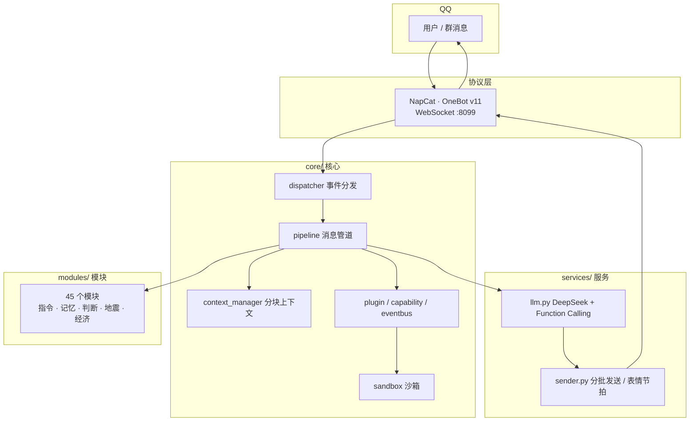
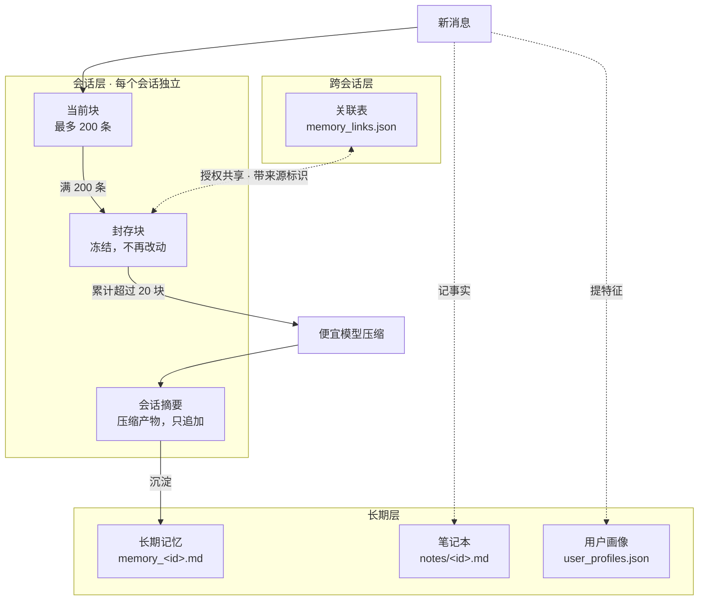
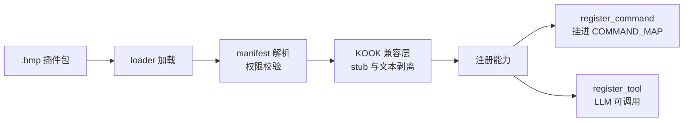
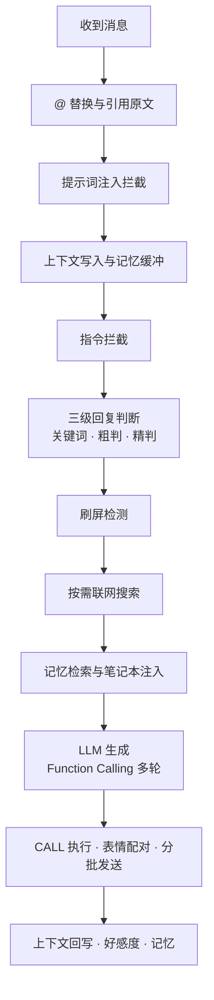

<div align="center">

<a href="https://github.com/Trusler258/huanmeng-qqbot">
  
</a>

**记得住聊过什么，装得上插件**

<sub>189 个 Python 文件 · 45 个模块 · 76 条指令 · 131 次提交</sub>

<br>
<br>

[](https://www.python.org/)
[](data/update_log.md)
[](LICENSE)
[](https://github.com/botuniverse/onebot)
[](https://github.com/NapNeko/NapCatQQ)
[](https://platform.deepseek.com/)

[](https://github.com/Trusler258/huanmeng-qqbot/stargazers)
[](https://github.com/Trusler258/huanmeng-qqbot/commits/main)
[](https://github.com/Trusler258/huanmeng-qqbot/commits/main)
[](https://github.com/Trusler258/huanmeng-qqbot)

[](#)
[](#)
[](#)
[](#)

</div>

---

> [!IMPORTANT]
> QQ 平台上有个第三方公开的同名「幻梦」机器人，跟这个项目无关；「幻梦」只是默认角色名
> 本项目基于 [NapCat](https://github.com/NapNeko/NapCatQQ) 协议适配，与官方接口、机器人平台无关
>
> 社区开源版，部分私有模块未包含

---

<a id="overview"></a>
## 概览

上下文不是只留最近 N 条

对话历史按 200 条切块，封存后不再改动；攒够 20 块交给便宜模型压成摘要，摘要只往后追加；整段历史只追加，前缀不会被打散

另一条线是扩展性：插件热插拔，指令和工具都通过能力注册表挂载，KOOK 的插件能直接拿来跑

<table>
<tr>
<td width="50%" valign="top">

**记忆**

- 200 条一块，封存即冻结
- 满 20 块自动压缩
- 长期记忆、笔记本、用户画像各管一摊
- 会话之间可以授权共享

</td>
<td width="50%" valign="top">

**扩展**

- `.hmp` 插件热插拔
- 指令 / 工具 / 插件统一注册
- KOOK 插件直接加载
- 事件总线 + 沙箱

</td>
</tr>
</table>

<a id="features"></a>
## 功能清单

<details>
<summary><b>完整能力</b></summary>

<br>

| 分类 | 能力 |
|------|------|
| 对话 | 多轮对话、三级回复判断、防复读、刷屏拦截、@ 触发、私聊与群聊风格分离 |
| 记忆 | 分块会话历史、长期记忆压缩、笔记本、跨会话关联、用户画像 |
| 搜索 | 自动判断是否联网、搜索结果来源如实标注、聊天记录全文检索（SQLite FTS5） |
| 图片 | 图片识别注入上下文、生图、图生视频、表情库逐句配图 |
| 群管理 | 发言统计、成员信息、群笔记、退群清理、撤回记录 |
| 娱乐 | 五子棋（人机 / 对战）、掷骰、抽签、每日运气 |
| 工具 | 天气、快递、翻译、倒计时、定时提醒、域名 WHOIS、代码生成与运行 |
| 音游 | TUF 谱面搜索、详情、下载直链 |
| 经济 | 积分、签到、商店、背包 |
| 插件 | `.hmp` 打包安装、插件库更新、人工审批 |
| 面板 | 独立进程 Web 后台（配置 / 日志 / 数据 / 崩溃自愈），见 [huanmeng-panel](https://github.com/Trusler258/huanmeng-panel) |
| 安全 | 提示词注入拦截、沙箱黑名单、指令权限分级 |

</details>

---

<a id="arch"></a>
## 架构

四层：核心、服务、模块、工具；任何一层缺失都不影响聊天主流程



<details>
<summary><b>目录结构</b></summary>

<br>

```
huanmeng-qqbot/
├── main.py                    # 入口
├── bot.py                     # 主循环 · 并发分发 · 后台任务
│
├── core/                      # 核心
│   ├── pipeline.py            # 消息管道
│   ├── context_manager.py     # 会话上下文（分块冻结）
│   ├── plugin/                # 插件系统（manifest / loader / manager）
│   ├── capability/            # 能力注册表（Command / Tool / Plugin）
│   ├── eventbus.py            # 事件总线
│   ├── sandbox.py             # 沙箱执行
│   └── bot_notes.py           # 笔记本
│
├── services/                  # 服务
│   ├── llm.py                 # LLM + Function Calling 多轮 Agent
│   └── sender.py              # WebSocket 发送 · 分批 · 表情节拍
│
├── modules/                   # 模块（45 个）
│   ├── commands.py            # 指令注册表 COMMAND_MAP
│   ├── help_card.py           # 指令卡片（描述唯一来源）
│   ├── memory.py              # 长期记忆
│   ├── memory_link.py         # 跨会话记忆关联
│   ├── judge.py               # 三级回复判断
│   ├── earthquake.py          # 地震速报
│   ├── reward.py              # 赞赏
│   └── …
│
├── data/
│   ├── skills/*.md            # 提示词章节
│   ├── templates/             # HTML 卡片模板
│   └── update_log.md          # 更新日志
│
└── utils/                     # 工具函数
```

</details>

---

<a id="memory"></a>
## 记忆系统



拼进 prompt 的顺序固定：

```
SYSTEM  →  长期记忆  →  会话摘要  →  BLOCK 1..N（冻结）  →  当前块  →  当前消息
```

### 层级

| 层 | 存在哪 | 说明 |
|------|------|------|
| 会话块 | 内存 + 磁盘 | 当前块满 200 条封存，累计 20 块触发压缩 |
| 长期 | `data/memory_<id>.md` | 周期性压缩沉淀 |
| 笔记本 | `data/notes/<id>.md` | LLM 自己维护的事实条目 |
| 用户画像 | `data/user_profiles.json` | 从对话提取的使用者特征 |
| 跨会话 | `data/memory_links.json` | 会话之间授权共享 |

### 跨会话记忆

同一个人在私聊和群聊说的话本来互不相通；`/~mlink` 让指定会话共享记忆，但不合并身份，LLM 始终知道每条来自哪里

```
/~mlink add p123456789    关联私聊
/~mlink add g123456789    关联群聊（需管理员）
/~mlink list              查看
/~mlink del [目标]        断开；不带目标则全部断开
```

注入格式：

```
【跨聊天记忆 · 来自其他会话】
—— 来源：私聊 123456789（最近 12 条）——
[admin] 小明: 我最近在研究缓存机制
幻梦: 那个确实值得优化
```

群聊来源只注入机器人自己的发言，群成员原话不出群；关联别人的私聊要对方同意，拒绝不告知请求方

---

<a id="plugin"></a>
## 插件系统

插件 = `plugins/<name>/manifest.json` + `main.py`（类名 `Plugin`，构造函数收 `ctx`）



<details>
<summary><b>插件能用的 ctx.*</b></summary>

<br>

| 能力 | 说明 |
|---|---|
| `ctx.message.send / send_file` | 发文本与文件 |
| `ctx.memory.remember / recall` | 记忆写入与检索 |
| `ctx.event.on / publish` | 事件总线 |
| `ctx.timer.every(秒)` | 周期定时器，卸载自动取消 |
| `ctx.capability.register_command` | 注册指令 |
| `ctx.capability.register_tool` | 注册 Function Calling 工具 |
| `ctx.economy` | 积分与库存 |
| `ctx.vision.describe` | 图片识别 |
| `ctx.llm.generate` | 文本生成 |
| `ctx.approval.request` | 人工审批 |
| `ctx.sandbox.run_python / cpp / shell` | 沙箱执行 |
| `ctx.logger` | 命名空间日志 |

</details>

插件库里大部分 `.hmp` 是给 KOOK 机器人写的，加载时注入 `khl` / `kook` 假模块并剥掉 KMarkdown 标记，不用改插件源码

```bash
/~plugin list              # 已装插件
/~plugin install <名|url>  # 安装
/~plugin pack <名>         # 打包成 .hmp
```

---

<a id="pipeline"></a>
## 消息管道



### 踩过的坑

- **并发分发** —— 每条消息独立任务，生图和视频不堵后面的消息
- **FC 最多 6 轮** —— 连续两次调同一组工具就熔断，防止死循环烧 token
- **工具单独超时** —— 一个慢接口不拖死整轮
- **长输出折中段** —— 保头尾，免得模型看着看着开始编
- **带图结果直发** —— 交给 LLM 转述，CQ 码会丢
- **按需内容放末尾** —— system 和块保持稳定前缀，缓存才命中

---

<a id="deploy"></a>
## 部署

> [!WARNING]
> QQ 账号等级 16 级以上，建议开 VIP；生产环境用 Linux

<details>
<summary><b>第一步 · Python 3.10+</b></summary>

<br>

| 系统 | 命令 |
|------|------|
| Windows | [python.org/downloads](https://www.python.org/downloads/)，勾 *Add Python to PATH* |
| Debian / Ubuntu | `sudo apt install python3 python3-pip -y` |
| CentOS / RHEL | `sudo yum install python3 python3-pip -y` |

</details>

<details>
<summary><b>第二步 · NapCat</b></summary>

<br>

```bash
# Linux 一键安装
curl -o napcat.sh https://nclatest.znin.net/NapNeko/NapCat-Installer/main/script/install.sh && bash napcat.sh --docker n --cli y

napcat                # 打开 TUI 扫码登录
napcat start <QQ号>   # 启动，默认 WebSocket 8099
```

Windows 从 [NapCatQQ Releases](https://github.com/NapNeko/NapCatQQ/releases) 下解压包

| 资源 | 地址 |
|------|------|
| 仓库 | [github.com/NapNeko/NapCatQQ](https://github.com/NapNeko/NapCatQQ) |
| 文档 | [napneko.github.io](https://napneko.github.io/guide/napcat) |

</details>

<details>
<summary><b>第三步 · 克隆与配置</b></summary>

<br>

```bash
git clone https://github.com/Trusler258/huanmeng-qqbot.git
cd huanmeng-qqbot

pip install -r requirements.txt
playwright install chromium        # 卡片渲染要

cp config/example.env config/.env   # 填 API Key
# config/bot_config.toml      → bot 的 QQ 号、管理员 QQ 号
# config/adapter_config.toml  → group_list，允许的群

python main.py
```

</details>

<details>
<summary><b>第四步 · 接上 NapCat</b></summary>

<br>

默认 `ws://127.0.0.1:8099/`；要改：

```toml
[napcat_server]
host = "127.0.0.1"
port = 8099
```

</details>

| 用到什么 | 谁提供 |
|------|------|
| 回复 / 判断 / 摘要 | [DeepSeek](https://platform.deepseek.com/) |
| 图片识别 | [智谱 AI](https://open.bigmodel.cn/)，可选 |
| 联网搜索 | DuckDuckGo，不用 Key |

---

<a id="commands"></a>
## 指令手册

共 **76 条指令**，含别名共 108 个触发词；`/~help` 会按当前功能开关生成卡片

<details>
<summary><b>聊天</b>（1 条）</summary>

```
/~help             指令手册：总览卡片 + 单个指令详情
```

</details>

<details>
<summary><b>系统</b>（13 条）</summary>

```
/~ping             在线检测 / 延迟测试
/~restart          远程重启 bot
/~info             系统运行状态
/~weather          天气查询（卡片）   〔天气〕
/~reload           热重载配置
/~update           从 git 拉取代码更新 bot   〔upd〕
/~updateinfo       更新日志   〔up〕
/~eq               地震速报与订阅   〔地震〕
/~nasa             NASA 每日天文图
/~tuflevel         TUF 谱面详情查询   〔tuf谱面〕
/~tufsearch        搜索 TUF 谱面
/~tufd             下载 TUF 谱面文件
/~tufpage          TUF 搜索结果翻页
```

</details>

<details>
<summary><b>数据</b>（13 条）</summary>

```
/~favlist          查看好感度排行榜
/~box              快递物流查询
/~recall           查看群消息撤回记录
/~stats            群聊今日统计   〔统计〕
/~unstats          暂停本群统计
/~setstats         恢复本群统计
/~balance          DeepSeek API 余额查询
/~cost             Token 消耗统计与费用
/~tokens           计算文本 token 数和费用
/~ctx              查看上下文用量
/~dbsearch         全文检索聊天历史   〔回顾〕
/~checkin          每日签到得积分   〔签到/sign〕
/~points           查看积分余额   〔积分〕
```

</details>

<details>
<summary><b>工具</b>（13 条）</summary>

```
/~search           联网搜索（百度/百科/Bing）
/~read             深度读取网页正文并总结
/~whois            域名注册信息查询   〔域名〕
/~remind           定时提醒（到点自动 @）   〔提醒〕
/~抽                随机抽取一个选项
/~analyze          零上下文日志分析（不带聊天记录）
/~tr               文本翻译   〔翻译〕
/~countdown        倒计时提醒   〔倒计时〕
/~cache            查看缓存命中率 [天数]
/~note             笔记本指令
/~mlink            跨聊天记忆关联（add/del/list/yes/no；关联他人私聊需同意）   〔记忆关联〕
/~reward           赞赏码与赞助名单（`仅发图` 只回图片；add 记录赞助）   〔赞赏/赞助/sponsor〕
/~shop             积分商店购买商品   〔商店〕
```

</details>

<details>
<summary><b>admin</b>（19 条）</summary>

```
/~ignore           全群忽略某用户（仅 admin）
/~unignore         解除全群忽略（仅 admin）
/~添加关系             添加用户关系（仅 admin）
/~resetfav         重置好感度数据（仅 admin）
/~op               OP 权限管理
/~persona          私聊人格切换   〔人格〕
/~主人               指定私聊主人
/~sleep            切换睡觉模式（仅 admin）
/~含蓄               切换含蓄叙述风格（仅 admin）   〔叙事〕
/~leave            退群并清理本群数据（仅 admin）
/~preset           系统提示词注入管理
/~owner            配置与数据管理
/~memory           三层记忆查询
/~nickname         同步群昵称到本地
/~添加               批准好友请求
/~拒绝               拒绝好友请求
/~好友列表             查看待处理好友请求
/~say              管理员代发消息到指定群/私聊   〔代发〕
/~key              实验测试项开关（全员可用，非管理员需先兑换许可码）   〔测试项〕
```

</details>

<details>
<summary><b>游戏</b>（9 条）</summary>

```
/~gh               公会登记管理
/~luck             每日运势抽签
/~pgr              Phigros 谱面查询
/~wzq              五子棋对战（人机/双人）   〔五子棋〕
/~xq               中国象棋对战   〔象棋〕
/~wdsj             洛花星雨战绩查询
/~sys              PC 状态卡片 / 截屏   〔pc〕
/~phone            手机实时状态
/~dice             掷骰子，掷骰奖励积分
```

</details>

<details>
<summary><b>创作</b>（6 条）</summary>

```
/~draw             AI 文生图 / 图生图   〔绘画〕
/~video            AI 文生视频   〔视频〕
/~voice            LLM 文本转语音   〔语音〕
/~img2video        图片转视频   〔图生视频〕
/~img              随机二次元图片
/~motou            用图片生成摸头 GIF   〔摸头〕
```

</details>

<details>
<summary><b>插件</b>（2 条）</summary>

```
/~plugin           插件管理（安装/卸载/更新）   〔插件〕
/~apy              插件人工审批回执
```

</details>


---

<a id="persona"></a>
## 自定义人设

角色自己写，默认那个猫娘只是示范；`config/bot_config.toml` 三段：

```toml
[personality]
personality_core = """
# 核心人格：性格、说话方式、行为准则
"""

personality_side = """
# 侧面人格：比如「有时会钻牛角尖」
"""

identity = """
# 固定身份：名字、种族、年龄、外貌、人际关系、底线
"""
```

好感度随对话变化，不同档位语气不同，跟角色无关，你写什么角色都照常跑

提示词分层放 `data/skills/*.md`，改完 `/~reload` 热加载：

| 文件 | 作用 |
|------|------|
| `00_core.md` | 常驻核心规则 |
| `10/11_format_*.md` | 群聊与私聊的格式和风格 |
| `40_reminders.md` | 每轮提醒，紧跟当前消息，最管用 |
| `70_deep_explain.md` | 知识类提问时的讲解规范 |
| `80_writing.md` | 写作管道 |
| `90_summary.md` | 会话摘要压缩 |

---

<a id="stats"></a>
## 项目数据

<div align="center">

| Python 文件 | 模块 | 指令 | 触发词 | 提交 |
|:---:|:---:|:---:|:---:|:---:|
| **189** | **45** | **76** | **108** | **131+** |

<sub>更新于 2026-09-14</sub>

</div>

版本演进见 [`data/update_log.md`](data/update_log.md)

---

## 赞赏

赞赏码 `data/images/reward_qrcode.png`，不在仓库内

---

## 贡献

PR 约定：

1. 新指令在 `modules/commands.py` 的 `COMMAND_MAP` 注册
2. 同时在 `modules/help_card.py` 补 `_CATEGORY` 和 `_EXTRA_DESC`，这两处是 `/~help` 和 LLM 指令清单的共同来源
3. 提示词写进 `data/skills/*.md`，不写进 Python
4. `data/update_log.md` 最新版本在最上面

---

## 开源协议

[MIT License](LICENSE) © 2024 Trusler

---

## 相关项目

- [huanmeng-panel](https://github.com/Trusler258/huanmeng-panel) — 配套的 Web 控制面板（独立项目）
- [NapCat](https://github.com/NapNeko/NapCatQQ) — QQ 协议适配
- [OneBot v11](https://github.com/botuniverse/onebot) — 机器人接口标准
- [DeepSeek](https://platform.deepseek.com/) — 大语言模型
- [智谱 AI](https://open.bigmodel.cn/) — 视觉模型

