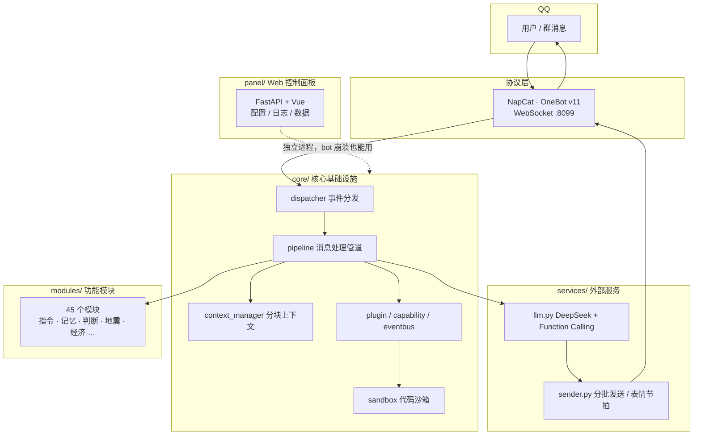
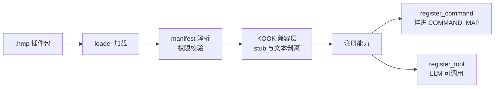
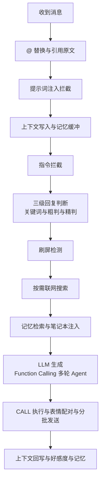

<div align="center">

<a href="https://github.com/Trusler258/huanmeng-qqbot">
  
  
  
</a>

**让机器人真的记得住。记忆与插件，都是一等公民。**

<sub>189 个 Python 文件 · 45 个功能模块 · 212 条指令 · 131 次提交</sub>

  

  
  


  


<a href="https://github.com/Trusler258/huanmeng-qqbot">
  
  
  
</a>
  


</div>

---

> [!IMPORTANT]
>   
> **与同名机器人无关。** QQ 平台上存在第三方公开的「幻梦」机器人，本项目与它**没有任何关系**；「幻梦」只是本项目的默认角色昵称。
>   
> 本项目基于 [NapCat](https://github.com/NapNeko/NapCatQQ) 社区协议适配，与任何官方接口、机器人平台无关。
>
> **本仓库是社区开源版。** 服务器运行版含额外私有模块，不在此仓库；克隆后可直接运行，缺失模块自动优雅降级。

---

<a id="overview"></a>

## 概览

绝大多数 QQ 机器人的上下文是 `history[-N:]`——一个滑动窗口，聊过就忘。幻梦把**记忆**当基础设施来做：会话历史分块冻结、长期记忆自动压缩、不同会话之间可以授权共享记忆。

同时它把**扩展性**也当基础设施：插件热插拔、能力注册表统一抽象、KOOK 生态插件能直接跑。

<table>
  
<tr>
  
<td width="50%" valign="top">

**记忆优先**

- 会话历史按 200 条分块，封存后不再变动
- 满 20 块自动压缩为会话摘要
- 长期记忆、笔记本、用户画像各自独立
- 跨会话记忆共享，带来源标识

</td>
  
<td width="50%" valign="top">

**扩展优先**

- `.hmp` 插件热插拔，一键安装与更新
- Command / Tool / Plugin 统一注册为「能力」
- KOOK 插件加载时自动兼容，无需改写
- 事件总线与沙箱执行

</td>
  
</tr>
  
</table>

其余能力（对话、搜索、图片识别、群管理、娱乐、音游、工具、经济、安全防护）见下方功能清单。

---

<a id="features"></a>

## 功能清单

<details>

<summary><b>完整能力一览</b></summary>

  


| 分类  | 能力                                        |
| --- | ----------------------------------------- |
| 对话  | 多轮对话、三级回复判断、防复读、刷屏拦截、@ 触发、私聊与群聊风格分离       |
| 记忆  | 分块会话历史、长期记忆压缩、笔记本、跨会话关联、用户画像              |
| 搜索  | 自动判断是否需要联网、搜索结果诚实归因、聊天历史全文检索（SQLite FTS5） |
| 图片  | 异步图片识别注入上下文、文本生图、图生视频、表情库逐句配图             |
| 群管理 | 发言统计、成员信息、群笔记、退群清理、撤回记录                   |
| 娱乐  | 五子棋（人机与对战）、掷骰、抽签、每日运气                     |
| 工具  | 天气、快递、翻译、倒计时、定时提醒、域名 WHOIS、代码生成与运行        |
| 音游  | TUF 谱面搜索、详情、下载直链                          |
| 经济  | 积分、签到、商店、背包（以插件形式提供，可卸载）                  |
| 插件  | `.hmp` 打包安装、插件库更新、人工审批                    |
| 面板  | 独立进程 Web 后台：配置编辑、日志、数据管理、崩溃自愈             |
| 安全  | 提示词注入拦截、沙箱黑名单、指令权限分级                      |

</details>

---

<a id="arch"></a>


## 架构

四层模块化：核心基础设施、外部服务、功能模块、工具函数。任何一层缺失都不影响聊天主流程——这是刻意的设计，让功能可以逐个拆掉而不炸。



<details>

<summary><b>目录结构</b></summary>

  


```
huanmeng-qqbot/
├── main.py                    # 入口
├── bot.py                     # 主循环 · 并发分发 · 后台任务
│
├── core/                      # 核心基础设施
│   ├── pipeline.py            # 消息处理管道
│   ├── context_manager.py     # 会话上下文（分块冻结）
│   ├── plugin/                # 插件系统（manifest / loader / manager）
│   ├── capability/            # 能力注册表（Command / Tool / Plugin）
│   ├── eventbus.py            # 事件总线
│   ├── sandbox.py             # 沙箱执行
│   └── bot_notes.py           # 笔记本
│
├── services/                  # 外部服务调用
│   ├── llm.py                 # LLM + Function Calling 多轮 Agent
│   └── sender.py              # WebSocket 发送 · 分批 · 表情节拍
│
├── modules/                   # 功能模块（45 个）
│   ├── commands.py            # 指令注册表 COMMAND_MAP
│   ├── help_card.py           # 指令卡片（描述单一来源）
│   ├── memory.py              # 长期记忆
│   ├── memory_link.py         # 跨会话记忆关联
│   ├── judge.py               # 三级回复判断
│   ├── earthquake.py          # 地震速报
│   ├── reward.py              # 赞赏
│   └── …
│
├── data/
│   ├── skills/*.md            # 提示词章节（常驻与按需注入）
│   ├── templates/             # HTML 卡片模板
│   └── update_log.md          # 更新日志（版本演进唯一权威）
│
├── panel/ + panel_web/        # Web 控制面板
└── utils/                     # 工具函数（写作管道等）
```

</details>

---

<a id="memory"></a>

## 记忆系统

这是整个项目投入最多的地方。


### 为什么是分块

LLM 的前缀缓存按「消息序列前缀」逐 token 匹配：前缀里哪怕变一个字，后面的缓存全部作废。滑动窗口 `history[-200:]` 每来一条新消息就整体前移一位，等于每轮都把历史前缀打碎——缓存只剩 system 部分能命中（实测命中率 58%）。

分块之后，历史变成**只追加、老块不动**的序列：新消息只进当前块，封存块永不修改，压缩产出的摘要也只追加。前缀因此能长期保持稳定。

### 层级

| 层级  | 存储                       | 说明                |
| --- | ------------------------ | ----------------- |
| 瞬时  | 内存                       | 当前块，最多 200 条，满则封存 |
| 会话块 | 内存与磁盘                    | 封存块冻结；累计 20 块触发压缩 |
| 长期  | `data/memory_<id>.md`    | 周期性压缩沉淀，永久保存      |
| 笔记本 | `data/notes/<id>.md`     | LLM 主动维护的事实条目     |
| 跨会话 | `data/memory_links.json` | 会话之间授权共享          |

### 跨会话记忆

同一个人在私聊和群聊里说过的话本来互不相通。`/~mlink` 让指定会话共享记忆，但**不合并身份**——LLM 始终知道每条信息来自哪个会话。

```
/~mlink add p123456789    关联某个私聊
/~mlink add g123456789    关联某个群聊（需管理员）
/~mlink list              查看已关联
/~mlink del [目标]        断开；不带目标则全部断开
```

注入时每个来源都带标识，并强制遵守会话边界：

```
【跨聊天记忆 · 来自其他会话】
—— 来源：私聊 123456789（最近 12 条）——
[admin] 小明: 我最近在研究缓存机制
幻梦: 那个确实值得优化
```

**隐私设计**：群聊来源只注入机器人自己的发言，群成员的原话不会流出那个群；关联他人私聊必须对方同意，被拒绝也不会告知请求方。

---

<a id="plugin"></a>


## 插件系统

插件 = `plugins/<name>/manifest.json` + `main.py`（类名 `Plugin`，构造接收 `ctx`）。



<details>

<summary><b>插件可用能力 ctx.*</b></summary>

  


| 能力                                     | 说明                          |
| -------------------------------------- | --------------------------- |
| `ctx.message.send / send_file`         | 发文本与文件（群聊、私聊）               |
| `ctx.memory.remember / recall`         | 记忆写入与检索                     |
| `ctx.event.on / publish`               | 事件总线订阅与发布                   |
| `ctx.timer.every(秒)`                   | 周期定时器，卸载自动取消                |
| `ctx.capability.register_command`      | 注册指令，自动挂进 `COMMAND_MAP`     |
| `ctx.capability.register_tool`         | 注册 Function Calling 工具（可常驻） |
| `ctx.economy`                          | 积分与库存                       |
| `ctx.vision.describe`                  | 图片识别                        |
| `ctx.llm.generate`                     | 文本生成                        |
| `ctx.approval.request`                 | 人工审批，私聊管理员回执                |
| `ctx.sandbox.run_python / cpp / shell` | 沙箱执行，黑名单与超时与输出截断            |
| `ctx.logger`                           | 插件命名空间日志                    |

</details>

**KOOK 生态兼容**：插件库里的 `.hmp` 大多是为 KOOK 机器人写的。加载时自动注入 `khl` / `kook` / `kaiheila` 假模块，并剥离 KMarkdown 标记（`(met)`、`(emj)` 等），KOOK 专有调用安全降级，插件照常运行——不需要改写插件源码。

```bash
/~plugin list              # 查看已装插件
/~plugin install <名|url>  # 从插件库安装
/~plugin pack <名>         # 打包成 .hmp 分享
```

---

<a id="pipeline"></a>

## 消息管道



### 设计取舍

这些是踩过坑之后定下来的。写在这里，是因为它们比功能列表更能说明项目的样子：

- **并发分发** —— 每条消息独立任务，生图与视频这类慢操作不再阻塞后续消息
- **Function Calling 多轮** —— 最多 6 轮工具调用；连续相同调用自动熔断，防止死循环
- **工具超时表** —— 单个慢工具不会拖死整轮对话
- **输出折叠** —— 工具的长输出保头尾、折叠中段，防止模型编造尾部结果
- **结果直发** —— 指令返回内容里带图片时原样发送，不交给 LLM 转述（转述一定会丢 CQ 码）
- **缓存友好** —— system 与会话块保持稳定前缀，一切按需内容注入到消息末尾

---

<a id="deploy"></a>


## 部署

> [!WARNING]
>   
> 前置要求：QQ 账号等级不低于 16 级（建议开通 VIP，低等级容易被风控拦截）。生产环境推荐 Linux。

<details>

<summary><b>第一步 · 安装 Python 3.10+</b></summary>

  


| 系统              | 命令                                                                                   |
| --------------- | ------------------------------------------------------------------------------------ |
| Windows         | [python.org/downloads](https://www.python.org/downloads/)，安装时勾选 *Add Python to PATH* |
| Debian / Ubuntu | `sudo apt install python3 python3-pip -y`                                            |
| CentOS / RHEL   | `sudo yum install python3 python3-pip -y`                                            |

</details>

<details>

<summary><b>第二步 · 安装 NapCat</b></summary>

  


```bash
# Linux 一键安装
curl -o napcat.sh https://nclatest.znin.net/NapNeko/NapCat-Installer/main/script/install.sh && bash napcat.sh --docker n --cli y

napcat                # 打开 TUI，扫码登录
napcat start <QQ号>   # 启动，默认 WebSocket 端口 8099
```

Windows 用户可从 [NapCatQQ Releases](https://github.com/NapNeko/NapCatQQ/releases) 下载一键包。

| 资源   | 地址                                                                 |
| ---- | ------------------------------------------------------------------ |
| 官方仓库 | [github.com/NapNeko/NapCatQQ](https://github.com/NapNeko/NapCatQQ) |
| 官方文档 | [napneko.github.io](https://napneko.github.io/guide/napcat)        |

</details>

<details>

<summary><b>第三步 · 克隆并配置</b></summary>

  


```bash
git clone https://github.com/Trusler258/huanmeng-qqbot.git
cd huanmeng-qqbot

pip install -r requirements.txt
playwright install chromium        # 卡片渲染依赖

cp config/example.env config/.env   # 填入 API Key
# config/bot_config.toml      → bot 的 QQ 号、管理员 QQ 号
# config/adapter_config.toml  → group_list，允许的群

python main.py
```

</details>

<details>

<summary><b>第四步 · 连接 NapCat</b></summary>

  


NapCat 默认在 `ws://127.0.0.1:8099/` 提供 WebSocket，通常无需改动。要改端口：

```toml
[napcat_server]
host = "127.0.0.1"
port = 8099
```

</details>

**第三方依赖**

| 用途           | 服务                                         |
| ------------ | ------------------------------------------ |
| LLM 回复与判断与摘要 | [DeepSeek](https://platform.deepseek.com/) |
| 图片识别         | [智谱 AI](https://open.bigmodel.cn/)，可选      |
| 联网搜索         | DuckDuckGo，免费无需 Key                        |

---

<a id="commands"></a>


## 指令手册

共 212 条（含别名）。`/~help` 会按当前功能开关自动生成卡片。

<details>
<summary><b>工具</b></summary>

<br>

```
/~help                指令手册
/~ping                在线检测
/~info                运行状态
/~weather <城市>      天气查询
/~box <单号>          快递查询
/~search <关键词>      联网搜索
/~read <url>          网页正文读取
/~whois <域名>        域名注册信息
/~tr <语言> <文本>     翻译
/~remind <时间> <事>   定时提醒
/~countdown           倒计时
/~ctx                 上下文用量与分块详情
/~cost / ~tokens      用量与开销
```

</details>

<details>
<summary><b>记忆</b></summary>

<br>

```
/~memory              记忆查询
/~note                笔记本查看与手动添加
/~回顾 <关键词>        聊天历史全文检索
/~mlink add <目标>     跨会话记忆关联
/~mlink list / del    查看与断开
/~favlist             好感度排行
```

</details>

<details>
<summary><b>娱乐与其他</b></summary>

<br>

```
/~wzq ai <难度>        五子棋人机
/~wzq duel @某人       五子棋对战
/~dice [面数]          掷骰子
/~luck                每日运气
/~抽 <选项> <选项>     随机抽取
/~tufsearch <曲名>     TUF 谱面搜索
/~stats               群发言统计
/~recall              撤回记录
/~eq                  地震速报与订阅
/~draw / ~video       生图与视频
```

</details>

<details>
<summary><b>插件与经济</b></summary>

<br>

```
/~plugin list         插件列表
/~plugin install <名>  安装插件
/~plugin pack <名>     打包 .hmp
/~apy <token> 同意|拒绝 插件审批回执
/~points              积分余额
/~sign                每日签到
/~shop / ~buy         积分商店
/~bag / ~use          背包与使用
```

</details>

<details>
<summary><b>管理员</b></summary>

<br>

```
/~owner               配置管理
/~reload              热重载配置
/~preset              提示词注入
/~key                 实验特性开关
/~reward add <人> <额> 记录赞助
/~say <目标> <内容>    代发消息
/~ignore / ~unignore  忽略某个用户
```

</details>

---

<a id="persona"></a>
## 自定义人设

角色完全由使用者定义，默认的猫娘只是示范。`config/bot_config.toml` 三段式：

```toml
[personality]
personality_core = """
# 核心人格：内在性格、说话方式、行为准则
"""

personality_side = """
# 侧面人格：细微特征，如「有时会钻牛角尖」
"""

identity = """
# 固定身份：名字、种族、年龄、外貌、人际关系、行为底线
"""
```

好感度随对话自然变化，不同档位对应不同语气。这套机制与角色无关——你定义什么角色，它都照常工作。

提示词分层放在 `data/skills/*.md`，改完 `/~reload` 热加载：

| 文件 | 作用 |
|------|------|
| `00_core.md` | 常驻核心规则 |
| `10/11_format_*.md` | 群聊与私聊格式和风格 |
| `40_reminders.md` | 每轮提醒，紧跟当前消息，效力最高 |
| `70_deep_explain.md` | 知识类提问时注入的深度讲解规范 |
| `80_writing.md` | 写作管道（作文与文件生成） |
| `90_summary.md` | 会话摘要压缩 |

---

<a id="stats"></a>
## 项目数据

<div align="center">

| Python 文件 | 功能模块 | 指令 | 提交 |
|:---:|:---:|:---:|:---:|
| **189** | **45** | **212** | **131+** |

<sub>数据来自仓库实时统计，更新于 2026-09-14</sub>

</div>

版本演进见 [`data/update_log.md`](data/update_log.md)：从 Beta 0.4.3 到当前版本，每个版本都写清楚改了什么、为什么改。

---

## 赞赏

幻梦的服务器与模型开销靠使用者们的心意支撑。赞助过的人会被记入感谢名单，并常驻于机器人的提示词中。

> 部署自己的实例时，把赞赏码放到 `data/images/reward_qrcode.png` 即可。该文件不入仓库，避免把个人收款码带进别人的部署。

---

## 贡献

欢迎提交 Issue 与 Pull Request。提交前请确认：

1. 新增指令在 `modules/commands.py` 的 `COMMAND_MAP` 注册
2. 同步在 `modules/help_card.py` 补两处：`_CATEGORY`（分类）与 `_EXTRA_DESC`（描述）——这是 `/~help` 与 LLM 指令清单的共同来源
3. 提示词改动写进 `data/skills/*.md`，不要硬编码进 Python
4. 更新 `data/update_log.md`，最新版本写最上面

---

## 开源协议

[MIT License](LICENSE) © 2024 Trusler

---

## 相关项目

- [NapCat](https://github.com/NapNeko/NapCatQQ) — QQ 协议适配
- [OneBot v11](https://github.com/botuniverse/onebot) — 机器人应用接口标准
- [DeepSeek](https://platform.deepseek.com/) — 大语言模型 API
- [智谱 AI](https://open.bigmodel.cn/) — 视觉模型 API

<br>

<div align="center">

<sub>如果这个项目对你有帮助，点个 Star 是最好的支持</sub>

</div>
