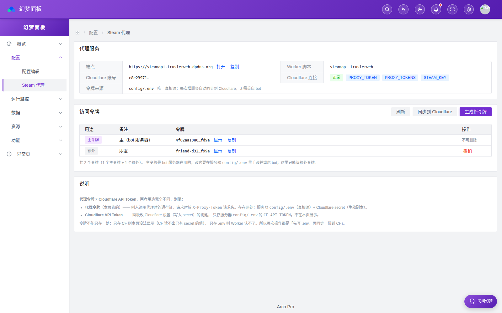
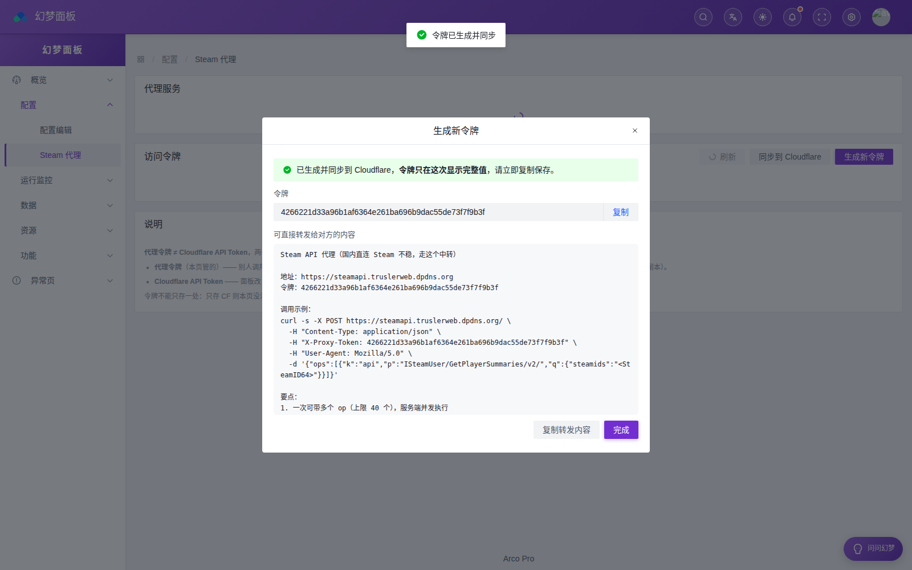

# Steam API 代理 使用教程

> 服务地址：`https://steamapi.truslerweb.dpdns.org`
> 部署方式与踩坑见 `deploy/cf-steam-proxy/README.md`（Cloudflare Worker）
>
> 作者：**Trusler** · [@Trusler258](https://github.com/Trusler258) ｜ © 2026
>
> 文中的响应结构与耗时**均为实测**；`steamid`、`TOKEN` 等已替换成占位符。

## 一、它是干什么的

国内（尤其电信）直连 Steam 的两个域名时通时断，实测一天断三次、每次 20 分钟上下，
不通时每个请求要干等 25~30 秒超时。这个代理部署在 Cloudflare 边缘（境外），
把请求中转出去：

```
你的服务器（国内）  →  steamapi.truslerweb.dpdns.org（CF 边缘）  →  Steam
```

它只做一件事：**替你请求 Steam 并原样返回 JSON**。附带三个好处：

1. **合并请求** —— 一次 POST 可带多个上游调用，Worker 内并发执行（跨境每趟 1~2 秒，
   一个请求占一趟的话，一次业务几十趟反而更慢）
2. **自动分批** —— `appids` 传几十个也没关系，Worker 内部切批并发再合并
3. **key 不在你手上** —— Steam Web API key 存在 Worker secret 里，调用方无需持有

实测收益（92 款游戏价格）：直连 75,013 ms → 经代理 **3,873 ms**，
而且有价覆盖从 37/92 提到 **72/92**（代理侧到 Steam 更稳）。

## 二、快速开始

准备两样东西：**地址** 和 **令牌**（`PROXY_TOKEN`，部署时设定）。

```bash
export STEAM_PROXY="https://steamapi.truslerweb.dpdns.org"
export STEAM_PROXY_TOKEN="<你的 TOKEN>"

# 1) 先确认服务活着（不需要令牌）
curl -s "$STEAM_PROXY/" | python3 -m json.tool

# 2) 查一个玩家的在线状态
curl -s -X POST "$STEAM_PROXY/" \
  -H "Content-Type: application/json" \
  -H "X-Proxy-Token: $STEAM_PROXY_TOKEN" \
  -H "User-Agent: Mozilla/5.0" \
  -d '{"ops":[{"k":"api","p":"ISteamUser/GetPlayerSummaries/v2/",
               "q":{"steamids":"<STEAMID64>"}}]}' | python3 -m json.tool
```

第 1 步会返回：

```json
{"ok": true, "service": "steam-api-proxy", "host": "steamapi.truslerweb.dpdns.org",
 "has_steam_key": true, "auth_required": true, "ad_batch": 15, "max_ops": 40}
```

`has_steam_key` 是 `false` 说明 Worker 侧没配 key，任何 `k=api` 的 op 都会失败。

第 2 步返回（截断）：

```json
{"ok": true, "n": 1, "ms": 393,
 "r": [{"i": 0, "ok": true, "status": 200,
        "data": {"response": {"players": [{
            "steamid": "<STEAMID64>", "personaname": "<昵称>",
            "personastate": 1, "communityvisibilitystate": 3,
            "gameextrainfo": "A Dance of Fire and Ice"}]}}}]}
```

## 三、接口参考

### 3.1 `POST /` —— 批量代理

**请求头**

| 头 | 必填 | 说明 |
|---|---|---|
| `Content-Type` | 是 | `application/json` |
| `X-Proxy-Token` | 视部署而定 | 服务端配的令牌之一；不匹配返回 **401**<br>（支持多令牌、一人一个，便于单独撤销 —— 见 `deploy/cf-steam-proxy/README.md`） |
| `User-Agent` | **建议填** | 见下方「403 排查」—— CF 会拦 Python 默认 UA |

**请求体**

```json
{
  "ops": [
    {"k": "api",   "p": "ISteamUser/GetPlayerSummaries/v2/", "q": {"steamids": "xxx"}},
    {"k": "store", "p": "api/appdetails", "q": {"appids": "730,570", "filters": "price_overview"}}
  ]
}
```

| 字段 | 说明 |
|---|---|
| `k` | `"api"` → `api.steampowered.com`；`"store"` → `store.steampowered.com`。其他值报错 |
| `p` | 上游路径（**不含域名与开头的 `/`**），必须在白名单内（见第四节） |
| `q` | 查询参数（对象）。值为 `null`/`""` 的项会被丢掉 |

`k=api` 时**不用传 `key`** —— Worker 会注入。自己传了也会被忽略。
`k=store` 时会自动补 `cc=cn`、`l=schinese` 和浏览器 UA（不传就用默认，传了以你的为准）。

**响应体**

```json
{"ok": true, "n": 2, "ms": 283,
 "r": [
   {"i": 0, "ok": true,  "status": 200, "data": { ... }},
   {"i": 1, "ok": false, "status": 429, "error": "..."}
 ]}
```

| 字段 | 说明 |
|---|---|
| `ok` | **整批**是否正常处理（鉴权/格式问题才是 false） |
| `n` | op 数量 |
| `ms` | Worker 内部耗时（不含到你那台机器的网络往返） |
| `r` | 结果数组，**与请求的 ops 同序**，用 `i` 对应 |
| `r[].ok` | 该 op 是否成功 |
| `r[].data` | 上游返回的 JSON（成功时） |
| `r[].status` | 上游 HTTP 状态码 |
| `r[].cached` | 是否命中 Worker 边缘缓存（`k=store` 才有，实测意义不大，见第八节） |
| `r[].batches` | `k=store` 的 `appdetails` 自动分批后的批数 |

### 3.2 `GET /` —— 健康检查

不需要令牌，返回服务状态（`has_steam_key` / `auth_required` / `ad_batch` / `max_ops`）。
适合做监控探测。

## 四、白名单：能代理哪些上游

Worker **不是开放代理**，只放行下面这些前缀（其余一律 `path not allowed`）：

| `k` | 允许的路径前缀 |
|---|---|
| `api` | `ISteamUser/`、`IPlayerService/`、`ISteamUserStats/`、`ISteamNews/`、`ISteamApps/`、`ISteamAppService/`、`ISteamRemoteStorage/`、`ISteamWebAPIUtil/`、`IWishlistService/` |
| `store` | `api/appdetails`、`api/appreviews`、`api/storesearch`、`api/featuredcategories` |

> 需要放行别的接口时，改 `_worker.js` 的 `ALLOW` 常量后 `wrangler deploy`。

## 五、代码示例

### 5.1 Python + httpx（推荐，连接池复用）

```python
import asyncio
import httpx

BASE = "https://steamapi.truslerweb.dpdns.org"
TOKEN = "<你的 TOKEN>"
UA = ("Mozilla/5.0 (Windows NT 10.0; Win64; x64) AppleWebKit/537.36 "
      "(KHTML, like Gecko) Chrome/120.0.0.0 Safari/537.36")

# ★ 全局复用一个 client。实测同一趟调用的往返耗时：
#     urllib（每次新连接）   955 ~ 1103 ms
#     httpx（共享 client）   411 ~ 454  ms
#   差的就是每趟重新做 TLS 握手的那部分 —— 跨境场景下这一条最值钱
_client = httpx.AsyncClient(timeout=60, trust_env=False, verify=False,
                            headers={"User-Agent": UA})


async def steam_ops(ops):
    """一次请求打多个上游调用，返回与 ops 同序的结果列表"""
    r = await _client.post(BASE, json={"ops": ops},
                           headers={"X-Proxy-Token": TOKEN})
    r.raise_for_status()
    d = r.json()
    if not d.get("ok"):
        raise RuntimeError("代理拒绝: %s" % d.get("error"))
    return d["r"]


async def main():
    sid = "<STEAMID64>"
    rs = await steam_ops([
        {"k": "api", "p": "ISteamUser/GetPlayerSummaries/v2/", "q": {"steamids": sid}},
        {"k": "api", "p": "IPlayerService/GetSteamLevel/v1/", "q": {"steamid": sid}},
        {"k": "api", "p": "IPlayerService/GetBadges/v1/", "q": {"steamid": sid}},
    ])
    for r in rs:
        print(r["i"], r["ok"], list((r.get("data") or {}).keys()))

    # 92 款游戏价格：一次请求，Worker 内部自动分批
    appids = ["730", "570", "440", "977950", "1426210"]
    rs = await steam_ops([{"k": "store", "p": "api/appdetails",
                           "q": {"appids": ",".join(appids),
                                 "filters": "price_overview"}}])
    data = rs[0]["data"]
    for aid in appids:
        po = ((data.get(aid) or {}).get("data") or {}).get("price_overview") or {}
        print(aid, po.get("final_formatted") or "无价格（免费/锁区）")


asyncio.run(main())
```

### 5.2 curl（排查首选）

```bash
# 多 op 合并
curl -s -X POST "$STEAM_PROXY/" \
  -H "Content-Type: application/json" \
  -H "X-Proxy-Token: $STEAM_PROXY_TOKEN" \
  -H "User-Agent: Mozilla/5.0" \
  -d '{"ops":[
        {"k":"api","p":"IPlayerService/GetSteamLevel/v1/","q":{"steamid":"<STEAMID64>"}},
        {"k":"api","p":"IPlayerService/GetBadges/v1/","q":{"steamid":"<STEAMID64>"}}
      ]}' | python3 -m json.tool
```

### 5.3 Node / 浏览器

```js
const BASE = "https://steamapi.truslerweb.dpdns.org";
const TOKEN = "<你的 TOKEN>";

const res = await fetch(BASE, {
  method: "POST",
  headers: { "Content-Type": "application/json", "X-Proxy-Token": TOKEN },
  body: JSON.stringify({
    ops: [{ k: "api", p: "ISteamUser/GetPlayerSummaries/v2/",
            q: { steamids: "<STEAMID64>" } }],
  }),
});
const { ok, r } = await res.json();
console.log(ok, r[0].data.response.players[0].personaname);
```

> 浏览器直接调要注意 CORS：Worker 已允许 `OPTIONS` 预检与 `X-Proxy-Token` 头，
> 但**不建议把 TOKEN 放进前端代码**（会被任何人看到）。

## 六、`appids` 自动分批

`k=store` 的 `api/appdetails` 传超过 **15** 个 appid 时，Worker 自动切批并发再合并，
**对调用方永远是一次请求一份结果**：

```
传入 20 个 appid  →  Worker 内部批数 = 2，有价格 15/20，Worker 侧耗时 254 ms
```

为什么需要它：

- Steam 侧一次塞太多会超时或 400
- 分批若放在调用方，就变成多次跨境往返，又慢又容易部分失败

⚠️ **多 appid 时必须带 `filters=price_overview`** —— 配 `filters=basic` 会 **400**。
（单 appid 时 `filters=basic` 正常，所以这个坑本地拿一个游戏试永远试不出来。）

## 七、错误处理：两个层级

这是最容易写错的地方 —— **失败可能发生在两个层级**：

| 层级 | HTTP | 表现 | 含义 |
|---|---|---|---|
| **整批失败** | 4xx | `{"ok": false, "error": "..."}` | 鉴权、格式、op 超限 —— 什么都没执行 |
| **单个 op 失败** | **200** | `r[i].ok = false, r[i].error` | 上游拒绝或白名单外 —— 其他 op 可能已成功 |

实测的各种失败：

```
6.1 错误 token            -> HTTP 401  {"ok":false,"error":"unauthorized"}
6.2 白名单外 path         -> HTTP 200  {"ok":true,"r":[{"i":0,"ok":false,"error":"path not allowed: ../../etc/passwd"}]}
6.3 未知 kind             -> HTTP 200  {"ok":true,"r":[{"i":0,"ok":false,"error":"unknown kind: evil"}]}
6.4 op 超过 40 个         -> HTTP 400  {"ok":false,"error":"too many ops (max 40)"}
6.5 没带 User-Agent       -> HTTP 403  error code: 1010
```

**所以调用方不能只看 HTTP 状态**，必须逐个检查 `r[i].ok`：

```python
for r in rs:
    if not r.get("ok"):
        logger.warning("op %s 失败: %s", r.get("i"), r.get("error"))
        continue
    use(r["data"])
```

## 八、限制与注意事项

| 项 | 值 / 说明 |
|---|---|
| 单次 op 数 | 最多 **40** 个（CF 免费版每请求子请求上限 50，留了余量） |
| `appdetails` 单批 | Worker 内 15 个一批，全自动 |
| 免费额度 | 10 万请求/天 —— 一次卡片约 3~8 个请求，够用几个数量级 |
| 边缘缓存 | `caches.default` **实测没命中**（两次同样请求都 3.8s）。Cache API 是数据中心级、不是全局，请求可能落到不同 colo。**缓存请放在你自己那侧** |
| 数据新鲜度 | 代理不缓存业务数据，你拿到的是上游实时结果 |
| 日志 | `wrangler tail` 可看实时日志（会打印路径，不打印 key） |

## 九、排查

| 现象 | 原因 | 处理 |
|---|---|---|
| **403 `error code: 1010`** | CF 的浏览器完整性检查拦了你的 UA（`Python-urllib/3.x` 必中） | 请求带上正常 UA。`httpx`、`curl`、浏览器 UA 都能过 |
| **401 unauthorized** | `X-Proxy-Token` 缺失或与 Worker 的 `PROXY_TOKEN` 不一致 | 检查两边是否一致（`printf` 写 secret 时别带多余换行） |
| **`{"ok":false,"error":"STEAM_KEY not set on worker"}`** | Worker secret 没配 | `wrangler secret bulk`（**不要用 `secret put`**，Windows 上会静默失败） |
| **健康检查 `has_steam_key: false`** | 同上 | 同上 |
| **`path not allowed: xxx`** | 请求的接口不在白名单 | 查第四节，或改 `_worker.js` 的 `ALLOW` |
| **打开域名 404 / 连不上** | 用了 `*.workers.dev` 地址 | 必须用绑定的自定义域（`*.workers.dev` 国内被墙） |
| **整批慢（>10s）** | 通常不是代理的问题 | 先看 `ms` 字段：`ms` 小 = Worker 快、慢在你的网络上；`ms` 大 = 上游慢（Steam 侧限流） |

## 十、在自己的项目里接入（本项目做法）

本项目的接入点是 `services/steam_api.py`，设计成**配了就生效、不配就退回直连**：

```bash
# /root/bot/config/.env
STEAM_PROXY=https://steamapi.truslerweb.dpdns.org
STEAM_PROXY_TOKEN=<你的 TOKEN>
```

核心就三处：

1. `_get_json()` 里判断 `proxy_on()` → 把 `(url, params)` 拆成 `(kind, path)` 走代理
2. 需要批量时（如查 92 款价格）单独调 `_proxy_call(ops)` 一次发完
3. **共享一个 `httpx.AsyncClient`** —— 这条最容易被忽略。实测同一趟调用：
   urllib（每次新连接）955~1103 ms，httpx（共享 client）411~454 ms ——
   差的就是每趟重新握手的那部分

## 十一、自建 / 换域名

这套代理不绑定 Steam，改 `ALLOW` 白名单和 `API_HOST`/`STORE_HOST` 就能给别的上游用。
源码与部署步骤：`deploy/cf-steam-proxy/`（`_worker.js` + `wrangler.toml` + `README.md`）。

```bash
cd deploy/cf-steam-proxy
wrangler deploy                          # 改完 _worker.js 后重新部署
printf '{"STEAM_KEY":"...","PROXY_TOKEN":"..."}' > _secrets.json
wrangler secret bulk _secrets.json       # 改 secret（会自动触发新版本）
rm -f _secrets.json
wrangler tail                            # 实时日志
```

## 十二、令牌管理与面板页

### 12.1 两种 token 别混（最常见的误解）

| | **代理令牌** `PROXY_TOKEN` / `PROXY_TOKENS` | **Cloudflare API Token** `CF_API_TOKEN` |
|---|---|---|
| 是什么 | 别人**调用代理**时的通行证 | 面板**改 Cloudflare 设置**的钥匙 |
| 谁用 | 你、你朋友（各自的程序） | 只有服务器上的面板 |
| 请求时放哪 | `X-Proxy-Token:` 请求头 | `Authorization: Bearer …` 调 CF API |
| 存在哪 | `.env` + CF secret（**两处**） | 只存 `.env` |
| 本页管吗 | 管 | 不管（只被面板内部使用） |

**代理令牌不可能只存一处**：

```
朋友的程序 ──直接请求──> Cloudflare Worker   ← 鉴权在这里发生
                              ↑
                  必须知道令牌才能放行（CF 读不出已有 secret 的值，
                  所以令牌必须写进去；而"写进去"这一步需要 CF API Token）

面板显示令牌 ──读──> 服务器 config/.env      ← 留档在这里
```

- 只存 CF → 面板没法显示令牌（CF 只回名字不回值），管理页就做不出来
- 只存 .env → Worker 认不了，令牌形同虚设

所以 **`.env` 是真相源，CF 是它的生效副本** —— 面板每次操作都是
「先写 `.env`，再把整份同步到 CF」。

### 12.2 面板页：配置 → Steam 代理

打开 `https://<你的面板地址>/config/proxy`（菜单：**配置 → Steam 代理**）。



生成令牌时的弹窗（明文 + 可直接转发的整段说明）：



能做的事：

| 操作 | 说明 |
|---|---|
| 看令牌列表 | 主令牌 / 额外令牌、备注、脱敏显示（可点「显示」看全文） |
| 生成新令牌 | 填个备注（给谁用）→ 生成 → 弹窗显示明文 + 一段可直接转发给对方的内容 |
| 撤销 | 点对应行的「撤销」→ 只删这一个，**不影响其他人、不用换主令牌** |
| 同步到 Cloudflare | 手动把 `.env` 全量推一遍（怀疑不一致时用） |
| 状态自检 | Worker 名、账号、CF 连通性、CF 侧已有的 secret 名 |

**改完不用重启 bot** —— 额外令牌只影响 CF 侧（Worker 的鉴权），bot 自己的主令牌没动。
只有**换主令牌**才需要手改服务器 `config/.env` 的 `STEAM_PROXY_TOKEN` 并重启 bot
（面板不允许改主令牌，避免把自己踢下线）。

### 12.3 用什么格式存

```
# /root/bot/config/.env
STEAM_PROXY_TOKEN=<主令牌>                      # bot 自己在用
STEAM_PROXY_TOKENS=<令牌>:<备注>,<令牌>:<备注>   # 给别人的，逗号分隔
```

`.env` 里的格式与 CF 侧 `PROXY_TOKENS` **完全一致** —— 同步就是原样搬运，
中间不做任何转换，所以面板上看到的和 Worker 生效的必然一致。

⚠️ 备注里不能有 `,` 和 `:`（会破坏 `令牌:备注` 的编码），面板会自动替换成空格。

### 12.4 面板需要的 CF 权限

面板调 Cloudflare API 写 secret，需要 `CF_API_TOKEN` 具备：

```
Account → Workers 脚本 → 编辑
```

获取：`https://dash.cloudflare.com/profile/api-tokens` → Create Token →
Create Custom Token → 权限选上面那条 → 账号资源选自己的账号。

⚠️ 权限改动后可能不是立即生效（实测等 40 秒仍可能拒绝），
过一会儿再试即可；**令牌值本身不用变**。

### 12.5 硬约束：CF 读不出已有 secret 的值

Cloudflare 的 API **只返回 secret 的名字，不返回值**。所以：

- 想「从 CF 反查谁拿了哪个令牌」——**做不到**，必须自己存台账
- 本项目的台账就是 `config/.env` 本身（单一真相源，不再另留一份明文文件）

这也是为什么面板的列表来自 `.env` 而不是 CF。

### 12.6 面板接口（供二次开发）

前缀 `/api/steam-proxy`，均需面板登录态：

| 方法 | 路径 | 作用 |
|---|---|---|
| GET | `/status` | CF 连通性 + 权限自检（返回 worker / account_id / ok / cf_secrets） |
| GET | `/tokens` | 令牌列表（读 `.env`）+ CF 同步状态（返回 tokens / count / cf_ok …） |
| POST | `/tokens` | 生成新令牌，body `{"label": "给谁用"}`，返回明文令牌（**只此一次**） |
| DELETE | `/tokens/{id}` | 撤销；`id` 取列表里的 `id` 字段（`main` 拒绝） |
| POST | `/sync` | 把 `.env` 全量同步到 Cloudflare |

⚠️ `/status` 与 `/tokens` **字段不重叠** —— `worker`/`account_id`/`ok` 只在 `/status`，
`tokens`/`count`/`cf_error` 只在 `/tokens`。前端必须把两个响应合并，
只取其中一个会让「Worker 名」显示成 `--`、CF 状态错显「异常」。

### 12.7 验收

`tests/_verify_proxy_page.py`（服务器上跑）—— 真机 Playwright + 真调 Worker：

```bash
cd /root/bot && python3 tests/_verify_proxy_page.py
```

21 项断言，含**端到端闭环**：面板生成令牌 → 用这个令牌真调一次 Worker（200）
→ 撤销 → 同一令牌立即 401，且主令牌与朋友令牌都不受影响。
脚本会把自己造的令牌删干净（finally 兜底），可重复运行。
